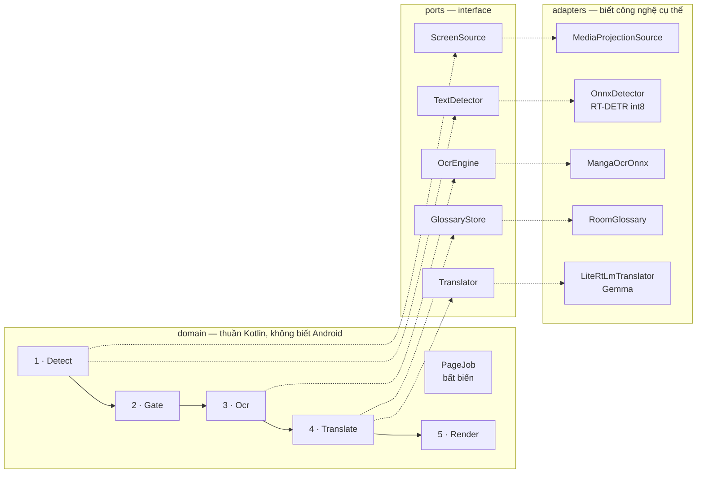
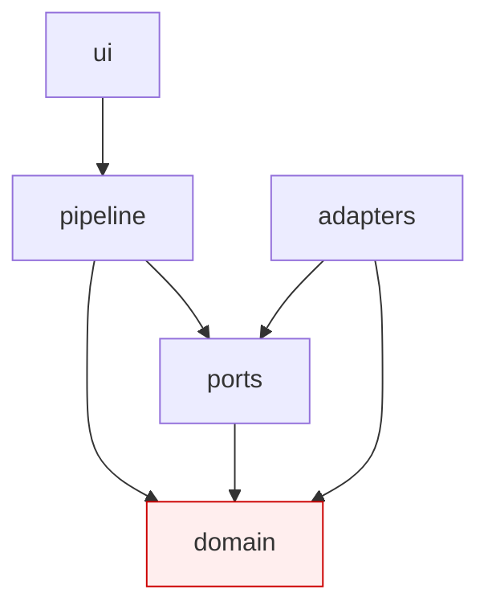
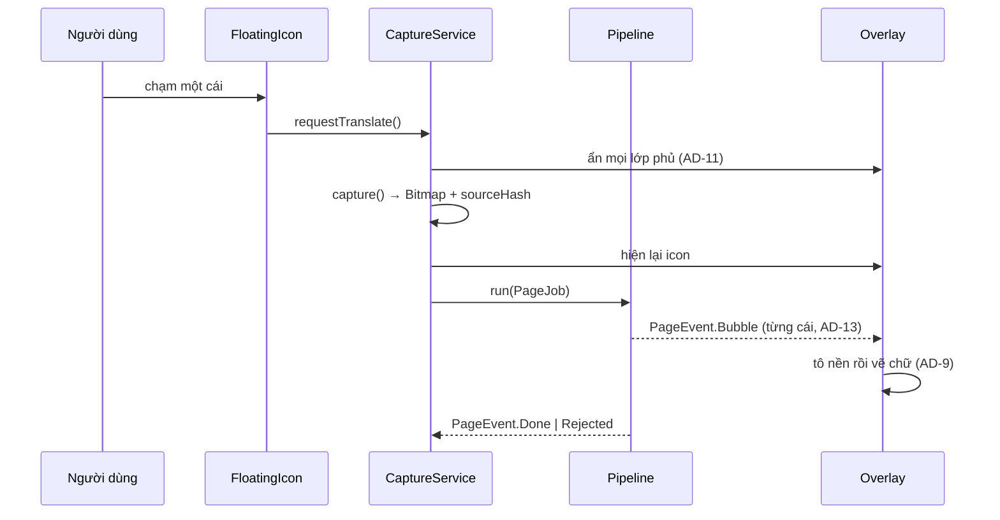

# Architecture Spine — Manga Translator JA→VI Offline

## Design Paradigm

**Pipes-and-Filters chạy sau ranh giới Ports-and-Adapters.**

Một lượt dịch là một `PageJob` **bất biến** chảy qua 5 filter thuần tuý. Mỗi filter nhận `PageJob`, trả về `PageJob` mới có thêm dữ liệu — không filter nào sửa đầu vào của mình, không filter nào biết filter kế tiếp là ai.

Mỗi filter nặng (detector, OCR, LLM) nấp sau một **port**. Adapter là thứ biết đến ONNX Runtime hay LiteRT-LM; phần còn lại của app không biết.



Ánh xạ sang package:

| Layer | Package | Được phép biết |
|---|---|---|
| `domain` | `app.mangatrans.domain` | Chỉ Kotlin stdlib + coroutines |
| `pipeline` | `app.mangatrans.pipeline` | `domain` |
| `ports` | `app.mangatrans.ports` | `domain` |
| `adapters` | `app.mangatrans.adapters.*` | `ports`, `domain`, SDK Android, thư viện ngoài |
| `ui` | `app.mangatrans.ui` | `domain`, `pipeline` (qua ViewModel) |

---

## Invariants & Rules



Mũi tên là chiều **được phép phụ thuộc**. `domain` không trỏ đi đâu cả. `adapters` không bao giờ được `pipeline` hay `ui` import trực tiếp — chỉ nối bằng dependency injection ở tầng khởi tạo.

### AD-1 — `PageJob` bất biến là kiểu dữ liệu duy nhất đi qua pipeline

- **Binds:** cả 5 filter, `ports`, `ui`
- **Prevents:** mỗi filter tự định nghĩa DTO riêng rồi phải viết mapper giữa từng cặp; hoặc filter sau sửa dữ liệu filter trước khiến không tái hiện được lỗi
- **Rule:** mọi filter có chữ ký `suspend fun apply(job: PageJob): PageJob`. `PageJob` là `data class` với toàn `val`. Filter **không được** sửa đối tượng nhận vào — chỉ `copy()`. Mọi `PageJob` mang `jobId`, `frameHash` và `contentKey` (AD-18 — hai hash, hai vai, không dùng lẫn).

### AD-2 — LiteRT-LM là runtime LLM duy nhất, nấp sau port `Translator` `[ADOPTED]`

- **Binds:** `ports.Translator`, `adapters.litertlm`
- **Prevents:** rải lời gọi runtime khắp nơi rồi khoá cứng vào một runtime; hoặc chọn llama.cpp và kẹt với CPU-only
- **Rule:** chỉ package `adapters.litertlm` được import LiteRT-LM. `Translator` khai báo bằng khái niệm miền (`translate(page, glossary): TranslatedPage`), không lộ token, tensor, hay khái niệm nào của runtime.
- **Rule:** adapter **phải tự quản việc chọn backend**: thử GPU, bắt lỗi khởi tạo, **tự lùi về CPU**. LiteRT-LM **không có fallback tự động** — GPU init thất bại làm hỏng cả Engine. Coi CPU là đường mặc định, GPU là tối ưu có điều kiện.
- **Rule:** ghim phiên bản LiteRT-LM chính xác. Thư viện còn ở **0.x**, API có `@OptIn(ExperimentalApi::class)` — không dùng `latest.release`.

  ❌ **ĐÃ ĐO TRÊN MÁY THẬT — backend GPU KHÔNG dùng được trên Adreno 642L.** Nó khởi tạo được, chạy nhanh, báo chỉ số đẹp, nhưng **sinh ra rác**.

  | | GPU | **CPU** |
  |---|---|---|
  | `benchmark()` báo | 264.9 tok/s prefill · 8.3 decode | 59.7 · 6.0 |
  | Thời gian/trang | 4.5–20.1 s | 51.3–79.4 s |
  | **JSON hợp lệ** | **0/4 trang** | **4/4 trang** |
  | **Nội dung** | **rác đa ngôn ngữ** | tiếng Việt mạch lạc |

  Ví dụ đầu ra GPU: `[0] 俺, lại nhờ với mùi folksERICK唄` · `[4] Heyतरह_make###`. Đây là **hỏng số học trong kernel GPU**, không phải dịch sai.

  ⇒ **CPU là đường DUY NHẤT dùng được trên phần cứng này.**

  ⚠️ **Bài học phải nhớ:** `benchmark()` chỉ trả chỉ số **hiệu năng**, không có chỉ số **đúng/sai**. Kết luận "GPU chạy được" đưa ra lần đầu chỉ dựa trên tok/s là **sai**, và sai đúng theo kiểu AD-4 mô tả. Không bao giờ chấp nhận một backend chỉ vì nó nhanh — phải nhìn nội dung nó sinh ra.

### AD-3 — Toàn bộ bubble của một trang đi trong MỘT lần gọi LLM `[ADOPTED]`

- **Binds:** `pipeline.TranslateFilter`, `ports.Translator`
- **Prevents:** "tối ưu" thành gọi từng bubble riêng lẻ. **Đã đo, và lý do thật khác với lý do brief đưa ra:**

  | | Cả trang | Từng ô |
  |---|---|---|
  | **Tổng thời gian** (4 trang, 48 bubble) | **63.5 s** | 209.7 s |
  | Số lần gọi LLM | 4 | 48 |
  | Bubble đầu tiên | sau prefill | 4.1–4.7 s |

  **Từng ô chậm hơn 3.3 lần về tổng thời gian**, vì mỗi ô phải prefill lại toàn bộ system prompt và glossary. Quy sang M52: cả trang 179 s, từng ô sẽ là **~590 s**.

  ⚠️ **Sửa lại lý do cũ:** spine trước đây ghi "dịch từng bubble là nguyên nhân số một gây sai xưng hô". **Phép đo KHÔNG chứng minh được điều đó** — xưng hô ra giống hệt nhau ở cả hai cách. Chỗ cả-trang thắng rõ là **tính đầy đủ** (`まだ` bị mất, gạch Nhật `ーー` bị để sót khi dịch từng ô), không phải xưng hô.

  Lưu ý: phép đo truyền một đoạn mô tả bối cảnh cho **cả hai** cách, và đoạn đó làm sẵn việc mà ngữ cảnh-cả-trang lẽ ra phải làm — nên nó **đánh giá thấp** lợi thế của cả-trang. Giả định về xưng hô **chưa bị bác bỏ, chỉ là chưa chứng minh được**.
- **Rule:** `Translator` **không có** hàm nào nhận một bubble đơn lẻ. Chữ ký chỉ nhận cả trang. Ai muốn chia nhỏ phải sửa port, tức phải đọc lại AD này.
- **Rule:** "toàn bộ bubble" nghĩa là **toàn bộ bubble ĐÃ QUA cổng AD-5**. Vùng `Suspect` không được OCR nên không có chữ để dịch — chúng không vào prompt. Id đưa vào prompt là **id gốc do `DetectFilter` cấp**, giữ nguyên kể cả khi đã lọc bớt nên **có thể không liên tục** (ví dụ 0,1,3,6). Không đánh lại số: id không liên tục còn giúp AD-6 vì model không thể "trôi" bằng cách tăng dần.

### AD-4 — Đầu ra của model là dữ liệu KHÔNG đáng tin cho tới khi qua cổng kiểm tra

- **Binds:** `pipeline.GateFilter`, `pipeline.TranslateFilter`, `pipeline.RenderFilter`
- **Prevents:** vẽ lên màn hình thứ trông hợp lệ mà sai — hai lỗi đã quan sát thực tế: OCR bịa chữ ở vùng không có text (FINDINGS F2) và LLM gán bản dịch lệch bubble (F10). Cả hai **qua được** mọi kiểm tra kiểu và kiểm tra JSON
- **Rule:** giữa mỗi filter sinh dữ liệu và filter tiêu thụ nó phải có một **cổng kiểm tra tường minh**. JSON hợp lệ và đủ số phần tử **không** tính là đã kiểm tra. Mỗi cổng trả `Verdict.Accept | Retry | Reject`, và `Reject` luôn có đường thoái lui giữ nguyên bản tiếng Nhật (AD-9).

### AD-5 — Cổng vùng chữ: `text_bubble` phải nằm trong một `bubble`

- **Binds:** `pipeline.GateFilter`
- **Prevents:** đưa mảnh tranh cho manga-ocr, vì nó không có đầu ra "chỗ này không có chữ" và sẽ bịa ra câu tiếng Nhật trông hợp lý (F2)
- **Rule:** chỉ vùng `text_bubble` có **≥ 0.9 diện tích nằm trong** một box `bubble` mới được đưa sang OCR. Vùng không thoả bị hạ xuống `Suspect` và **không vẽ đè** — để nguyên chữ gốc. Đo được: 53/54 box thoả trên 6 trang test. Ngưỡng 0.9 là `[ASSUMPTION]`, chỉnh được bằng cấu hình, phải đo lại trên bộ rộng hơn.

### AD-6 — Cổng toàn vẹn ánh xạ: đối chiếu nguyên bản, không tin id

- **Binds:** `ports.Translator`, `pipeline.TranslateFilter`
- **Prevents:** F10 — model trả đủ 12 bubble, id chạy đúng 0→11, `done_reason: stop`, nhưng toàn bộ bản dịch lệch một ô từ bubble thứ tư. Người đọc thấy mọi bubble đều trôi chảy mà cả trang sai mạch
- **Rule:** contract của `Translator` bắt mỗi bubble trả về kèm **`jaEcho` = 2 ký tự đầu của nguyên bản tiếng Nhật** của chính bubble đó. Pipeline đối chiếu bằng **ba bước bắt buộc, không được bỏ bước nào**:
  1. Chuẩn hoá `NFKC`
  2. Bỏ dấu câu và khoảng trắng (`―ー…。、！？「」（）` và tương đương)
  3. Chấp nhận nếu **khoảng cách sửa ≤ 1 ký tự**

  **Thứ tự trường trong JSON là bắt buộc: `id` → `jaEcho` → `vi`.** Nhờ vậy `jaEcho` của một bubble về **trước** bản dịch của chính nó, và pipeline xác thực được **ngay khi từng bubble chảy về**, không phải chờ hết trang. Đây là điều làm AD-13 (vẽ dần) và AD-6 (xác thực) sống chung được — xem AD-17.

  Bubble nào `jaEcho` không khớp thì **dừng stream ngay tại đó**, `Retry` cả trang một lần. Vẫn lệch thì `Reject` cả trang (AD-9). Không vá từng bubble — lệch là hiện tượng của cả trang.

  **Đã đo** (`spike/r2_translate/run_q7b.py`): so khớp chính xác từng ký tự cho **1 báo động giả** (model trả `何を当て` thay vì `何が当て` — sai một trợ từ). Chuẩn hoá + sai ≤1 cho **0 báo động giả** trên đáp án thật, và **bắt được 11/11** ô lệch khi tiêm lỗi off-by-one. 2 ký tự đã đủ; dài hơn không tăng độ chính xác mà tốn thêm token.

### AD-7 — Glossary là state có DUY NHẤT một chủ sở hữu, ghi theo bộ truyện

- **Binds:** `ports.GlossaryStore`, `pipeline.TranslateFilter`, `ui.GlossaryScreen`
- **Prevents:** hai đường ghi (tự tích luỹ và người dùng sửa tay) đua nhau, khiến xưng hô đổi giữa chừng — đúng thứ glossary sinh ra để chặn
- **Rule:** mọi thay đổi glossary đi qua `GlossaryStore`, không ai được ghi thẳng xuống DB. Mục tự tích luỹ vào trạng thái `Proposed`, **không** được đưa vào prompt cho tới khi người dùng chuyển sang `Confirmed`. Mục người dùng nhập luôn thắng mục tự đề xuất. Khoá là `(seriesKey, surfaceForm)`.

### AD-8 — Glossary tự tích luỹ KHÔNG dùng model riêng

- **Binds:** `pipeline`, `adapters`
- **Prevents:** nhét thêm một model NER vào gói 3.8GB, tốn dung lượng và thời gian chạy, trong khi không có giải pháp NER tiếng Nhật nào chạy nhẹ được on-device (đã tra web)
- **Rule:** nguồn đề xuất chỉ gồm hai thứ **đã có sẵn, chi phí bằng 0**: (a) trường `speaker` mà LLM vốn đã trả về; (b) heuristic chuỗi — cụm katakana/kanji lặp lại qua nhiều trang cùng `seriesKey`. Không thêm model, không thêm tải về.

### AD-9 — Thoái lui luôn là chữ gốc, không bao giờ là ô trống

- **Binds:** `pipeline.RenderFilter`, mọi cổng kiểm tra
- **Prevents:** che mất chữ Nhật rồi không vẽ được gì — tệ hơn không làm gì (PRD FR-046)
- **Rule:** `RenderFilter` chỉ tô nền che chữ gốc khi **đã có** bản dịch được chấp nhận cho đúng bubble đó. Không bao giờ tô trước.
- **Rule:** vẽ **HAI LƯỢT trên toàn trang**, không tô-rồi-vẽ từng bubble một:

  ```
  lượt 1: tô nền cho TẤT CẢ bubble đã có bản dịch
  lượt 2: vẽ chữ cho TẤT CẢ
  ```

  **Vì sao:** bóng thoại **chồng lấn nhau**. Tô-rồi-vẽ từng cái thì nền của bubble vẽ sau **xoá mất chữ** của bubble vẽ trước. Đã thấy thật: `憎たらしいねェ` dịch đúng thành "Đáng ghét thật đấy." nhưng ảnh chỉ hiện "Đáng ghét thật" — chữ `đấy.` bị nền bóng bên cạnh xoá (`spike/FINDINGS.md` F26).

- **Rule:** giữ **ảnh gốc chưa vẽ**. Mỗi lần có bubble mới thì vẽ lại cả trang từ ảnh gốc. Đây cũng là thứ làm **AD-17 hoạt động được**: `Retracted` bỏ bubble khỏi danh sách rồi vẽ lại ⇒ chữ Nhật gốc hiện lại nguyên vẹn. Không có ảnh gốc thì không gỡ được gì.

- ⚠️ **Chỉ số đếm không thay được việc nhìn.** Qua bốn vòng sửa lỗi vẽ, log luôn báo `vẽ 12/12 bubble` trong khi ảnh sai rõ. Mỗi thay đổi ở `RenderFilter` phải kiểm bằng mắt trên ảnh thật.

### AD-10 — Lớp phủ chỉ vẽ, không bao giờ sửa app bên dưới

- **Binds:** `adapters.overlay`, `adapters.capture`
- **Prevents:** hiểu nhầm "thay thế chữ gốc" thành can thiệp vào app khác — điều vừa bất khả thi vừa sai. Và đây là điều làm FR-006 đúng miễn phí: gỡ lớp phủ là chữ gốc hiện lại
- **Rule:** app chỉ vẽ lên `WindowManager` overlay của chính nó. Trạng thái duy nhất mà một lượt dịch để lại là lớp phủ và cache. Đóng app phải gỡ sạch, không còn dấu vết.

### AD-11 — Ảnh chụp phải sạch: tự ẩn mọi lớp phủ trước khi chụp

- **Binds:** `adapters.capture`, `adapters.overlay`
- **Prevents:** chụp trúng chính icon và bản dịch cũ, khiến OCR đọc lại chữ Việt mình vừa vẽ rồi dịch tiếp chữ Việt sang tiếng Việt
- **Rule:** `ScreenSource.capture()` **tự** ẩn icon nổi và mọi lớp phủ, chờ một frame, chụp, rồi hiện lại. Không để trách nhiệm này cho người gọi — người gọi sẽ quên.
- **Rule:** ngoài lớp phủ của chính app, còn phải **cắt bỏ vùng status bar** khỏi ảnh trước khi detect. Từ Android 15 QPR1, hệ điều hành vẽ một **chip "đang chia sẻ màn hình" mà app KHÔNG ẩn được** — nó sẽ lọt vào ảnh chụp. "Ảnh chụp sạch" không tự nhiên mà có.

### AD-12 — Lớp phủ gắn với `sourceHash`, đổi nội dung là tự xoá

- **Binds:** `adapters.overlay`, `pipeline`
- **Prevents:** bản dịch trang trước nằm đè lên trang sau khi người dùng vuốt — sai nội dung mà nhìn vẫn như đúng (PRD FR-047)
- **Rule:** mỗi lớp phủ mang `frameHash` của ảnh sinh ra nó (AD-18 — **không** phải `contentKey`). Có bất kỳ tín hiệu nào cho thấy nội dung bên dưới đã đổi thì lớp phủ **tự xoá ngay**, không chờ lượt dịch mới. Thà mất bản dịch còn hơn hiện bản dịch sai chỗ.

### AD-13 — Mọi thứ ngoài main thread, kết quả chảy ra theo dòng

- **Binds:** `pipeline`, `ui`, `adapters`
- **Prevents:** ANR khi một lượt mất 30–90 giây (NFR-009); và chặn màn hình chờ đủ cả trang trong khi bubble đầu đã sẵn sàng
- **Rule:** `pipeline` trả `Flow<PageEvent>`, phát từng bubble ngay khi được chấp nhận. Không hàm nào trong `pipeline` hoặc `adapters` được chạy trên `Dispatchers.Main`. `ui` là nơi duy nhất chạm main thread.

### AD-14 — Cổng chặn: đo LiteRT-LM trên M52 trước khi xây phần còn lại

- **Binds:** thứ tự thi công của cả dự án
- **Prevents:** viết trọn app rồi mới phát hiện LLM chạy quá chậm trên Adreno 642L — lúc đó mọi quyết định phía trên đã cứng lại
- **Rule:** story đầu tiên của Phase 1 là một app trần chạy **Gemma 4 E2B bản int4** trên chính Galaxy M52 và đo ba thứ: `tok/s` trên backend GPU, `tok/s` trên CPU, và **chất lượng dịch lại đúng 48 bubble của bộ test** để biết int4 mất bao nhiêu điểm so với trần 77%. **Không viết UI, không viết overlay** cho tới khi có cả ba số.

  Hai nhánh thoát: GPU không dùng được trên Adreno 642L → xét lại AD-2. int4 tụt dưới 70% → xét lại AD-16 (cân nhắc E4B) hoặc ngưỡng NFR-004.

- **Rule:** **máy ảo KHÔNG thoả được cổng chặn này.** Máy ảo x86 đo ra tốc độ CPU của máy dev, không liên quan gì đến Snapdragon 778G; và nó không có Adreno 642L nên **không thể tái hiện** rủi ro OpenCL 2.0 — vốn là rủi ro chính. Ảnh ARM64 chạy qua phiên dịch lệnh còn vô nghĩa hơn. Ba con số của AD-14 **chỉ** lấy từ máy thật.

### AD-15 — Gói mô hình không nằm trong APK, và có phiên bản

- **Binds:** `adapters.assets`, `ui.Onboarding`
- **Prevents:** APK phình quá giới hạn (NFR-008); và tình trạng app mới chạy với file model cũ sau khi cập nhật
- **Rule:** APK không chứa trọng số model. Mỗi gói có một **manifest** khai báo phiên bản, checksum từng file, và khoảng phiên bản app tương thích. App từ chối nạp model có manifest ngoài khoảng. Tải phải **tiếp tục được chỗ dở**, không làm lại từ đầu.

### AD-16 — Gemma 4 **E2B** là model dịch, không phải E4B

- **Binds:** `adapters.litertlm`, `adapters.assets`, kích thước gói tải về
- **Prevents:** mặc định chọn model to hơn vì tưởng to là tốt — giả định đã bị phép đo bác bỏ hai lần liên tiếp (Gemma 3 4B thua E2B; qwen3:8b không hơn gì qwen3:4b mà chậm gấp 4)
- **Rule:** gói mặc định dùng **Gemma 4 E2B**. Repo HF có **nhiều biến thể, không phải một** — phải chọn đúng file cho backend:

  | File | Dung lượng | Dùng cho |
  |---|---|---|
  | `gemma-4-E2B-it.litertlm` | **2.59 GB** (2.41 GiB) | CPU |
  | `gemma-4-E2B-it-gpu.litertlm` | **2.01 GB** (1.87 GiB) | GPU |
  | `gemma-4-E2B-it_qualcomm_sm8750.litertlm` | 3.02 GB (2.81 GiB) | NPU, Snapdragon 8 Elite |

  Thử `Backend.GPU()` với file CPU rồi kết luận "GPU không chạy được" là **kết luận sai vì dùng sai file**.

  ⚠️ **Không có bản NPU nào cho Snapdragon 778G (`sm7325`)** — danh sách chỉ có `sm8750`, `qcs8275`, Tensor G5/G6, Intel. Đường NPU coi như đóng với M52; chỉ còn GPU và CPU. Muốn đổi sang E4B phải có **số đo trên M52** cho thấy nó hơn đủ để bù 1.07GB và phần tốc độ mất đi — không đổi vì cảm tính.

  **Đã đo** trên 48 bubble của bộ test khó nhất: E2B đạt ~77% so với ~47% của Gemma 3 4B, nhanh hơn (22–23 vs 16 tok/s), nhỏ hơn (2.58 vs 3.3GB). Nó còn tự nhận ra tên riêng ngoài glossary (`桔梗`→Kikyō, `コマ`→Koma) — nhóm lỗi mà Gemma 3 phải nhờ glossary mới vá được.

  ⚠️ `[ASSUMPTION]` phép đo chạy trên bản ollama **7.2GB độ chính xác cao**, không phải bản **int4 2.58GB** mà LiteRT-LM đóng gói. 77% là **trần**, không phải con số sẽ thấy trên máy. AD-14 phải đo lại đúng bản int4.

### AD-17 — Hợp đồng streaming: `Translator` trả `Flow`, chấp nhận theo từng bubble

- **Binds:** `ports.Translator`, `pipeline.TranslateFilter`, `adapters.overlay`, `ui`
- **Prevents:** hai nhánh code cùng "đúng AD" mà không lắp được: một bên viết `Translator` trả `TranslatedPage` trọn gói (đọc AD-6 là "xác thực cả trang"), bên kia trả `Flow` (đọc AD-13 là "phát từng bubble"). Và nếu đã vẽ rồi mới Reject thì phải gỡ bản dịch đã vẽ — thao tác không AD nào cho phép
- **Rule:** `Translator.translate(...)` trả **`Flow<BubbleTranslation>`**, không trả trọn gói. Vòng đời một lượt:
  1. Mỗi `BubbleTranslation` về → xác thực `jaEcho` ngay (AD-6) → `Accepted` thì phát ra ngoài để vẽ.
  2. Gặp bubble không khớp → **huỷ `Flow` ngay tại đó**, phát `PageEvent.Retracted(bubbleIds đã vẽ)`.
  3. `adapters.overlay` **bắt buộc** xử lý `Retracted`: gỡ đúng các bubble đó, khôi phục chữ Nhật gốc (AD-9).
  4. Thử lại một lần. Vẫn lệch → `Reject` cả trang.
- **Rule:** gỡ bản dịch đã vẽ là hành vi **được phép và bắt buộc hỗ trợ**, không phải trường hợp ngoại lệ. Ai viết `overlay` mà bỏ qua `Retracted` là vi phạm AD này.

### AD-18 — Tách `frameHash` và `contentKey`: một hash không gánh nổi hai vai

- **Binds:** `domain.PageJob`, `adapters.overlay`, `adapters.storage`
- **Prevents:** dùng chung một `sourceHash` cho hai mục đích có yêu cầu **ngược nhau**. Phát hiện đổi nội dung (AD-12) cần **cực nhạy**; khoá cache (AD-1) cần **bất biến**. Hash toàn khung thì đồng hồ status bar nhảy phút cũng xoá lớp phủ; hash hạ mẫu thì hai trang khác nhau đụng khoá và vẽ đè sai trang — đúng lỗi FR-047 định chặn
- **Rule:** `PageJob` mang **hai** giá trị, không bao giờ dùng lẫn:
  - **`frameHash`** — nhạy, tính trên khung đã **cắt bỏ status bar và thanh điều hướng** (AD-11). Chỉ dùng để phát hiện nội dung bên dưới đã đổi (AD-12). Không bao giờ làm khoá cache.
  - **`contentKey`** — bền, tính trên ảnh đã hạ mẫu và chuẩn hoá, **chỉ trên vùng các bubble đã phát hiện**. Chỉ dùng làm khoá cache (FR-060). Không bao giờ dùng để phát hiện thay đổi.
- **Rule:** va chạm `contentKey` là lỗi **không thể chấp nhận** (vẽ sai trang). Mục cache phải lưu kèm danh sách bounding box và **đối chiếu lại trước khi dùng**; lệch thì coi như cache miss.

### AD-19 — MVP dùng MỘT glossary chung; `seriesKey` chưa tồn tại

- **Binds:** `ports.GlossaryStore`, `adapters.storage`, `ui.GlossaryScreen`
- **Prevents:** `seriesKey` được AD-7 và AD-8 dùng làm khoá chính nhưng **không AD, port hay filter nào sinh ra nó**. Hai cách hiện thực hợp lý — người dùng chọn tay, hoặc suy từ package name của app đang chạy trước — cho ra hai bộ dữ liệu không thấy nhau. Cách thứ hai còn đòi quyền `UsageStats`/Accessibility, phá vỡ câu chuyện "chỉ hai quyền" của PRD và va vào AD-10
- **Rule:** MVP dùng **một glossary toàn cục duy nhất**. `seriesKey` cố định bằng hằng số `"default"`. Vẫn giữ cột đó trong schema để sau này tách được mà không phải migrate.
- **Rule:** **cấm** suy `seriesKey` từ app đang chạy trước, hay bất cứ nguồn nào đòi thêm quyền. Khi nào thật sự cần tách theo bộ truyện thì người dùng chọn tay — và đó là một AD mới, không phải chỗ để ứng biến.

### AD-20 — Hâm nóng engine lúc bật app, không phải lúc chạm icon

- **Binds:** `service.CaptureForegroundService`, `adapters.litertlm`, `ui`
- **Prevents:** `engine.initialize()` **đã đo trên M52: 28.9 s (CPU) và 37.0 s (GPU)** — Google cảnh báo "tới 10 giây", thực tế **gấp 3–4 lần**. Nếu nó chạy ở lần chạm icon đầu tiên thì người dùng ngồi chờ nửa phút trước khi có token nào. Ngân sách 8s của NFR-005 **chỉ đúng khi engine đã nóng sẵn**
- **Rule:** engine được nạp **khi bật app** (lúc icon nổi xuất hiện), chạy nền, không chặn UI. Icon hiện trạng thái "đang chuẩn bị" và **không nhận chạm** cho tới khi engine sẵn sàng. Ngân sách NFR-005 tính từ lúc chạm, **với engine đã nóng**.
- **Rule:** engine **giữ sống** suốt thời gian app bật. Không nạp lại mỗi lượt. Giải phóng ở đúng một chỗ: đường đóng app của AD-10.

### AD-21 — Phiên chụp màn hình là tài nguyên có chủ, và nó chết bất ngờ

- **Binds:** `adapters.capture`, `service.CaptureForegroundService`
- **Prevents:** ba cách chết mà MediaProjection thực sự có, và FR-016 ("xin quyền một lần rồi giữ sống") che mất
- **Rule:** một `MediaProjection` chỉ được có **một `VirtualDisplay`**. Service là chủ sở hữu duy nhất; không nơi nào khác được tạo thêm.
- **Rule:** **bắt buộc** đăng ký `MediaProjection.Callback.onStop()`. Thiếu nó thì `createVirtualDisplay()` ném `IllegalStateException` trên các bản Android mới.
- **Rule:** **khoá màn hình làm dừng phiên chiếu.** Người dùng khoá máy rồi mở lại là phải xin quyền lại. Đây là hành vi bình thường, không phải lỗi — icon phải hiện trạng thái cần cấp lại quyền thay vì im lặng hỏng (FR-014).

### AD-22 — Phân vai máy ảo và máy thật

- **Binds:** mọi story có tiêu chí nghiệm thu
- **Prevents:** hai kiểu sai ngược nhau — đo hiệu năng trên máy ảo rồi tưởng là số thật; hoặc tuyên bố "đã hỗ trợ Android 14/15" trong khi thiết bị đo chuẩn chạy Android 13 nên chưa bao giờ chạy qua đường code đó
- **Rule:** mỗi story phải ghi rõ nghiệm thu ở đâu:

  | Loại tiêu chí | Chạy ở đâu |
  |---|---|
  | Logic pipeline, overlay, luồng quyền, gỡ lỗi hằng ngày | Máy ảo |
  | Đường code **Android 14/15/16/17** (`foregroundServiceType`, xin lại quyền mỗi phiên, chip chia sẻ màn hình không ẩn được) | **Chỉ máy ảo** — M52 chạy tối đa Android 13 nên không test được |
  | tok/s, GPU có dùng được không, RAM, OOM-kill, nhiệt/throttle | **Chỉ Galaxy M52** |

- **Rule:** cấm viết "đã hỗ trợ Android 15" nếu chưa chạy qua máy ảo Android 15. Cấm viết bất kỳ con số hiệu năng nào lấy từ máy ảo.

### AD-23 — Khai báo `uses-native-library` là điều kiện để GPU hoạt động

- **Binds:** `AndroidManifest.xml`, `adapters.litertlm`
- **Prevents:** kết luận sai rằng phần cứng không hỗ trợ GPU, trong khi thật ra chỉ thiếu một dòng khai báo. Đã suýt xảy ra: máy báo `FAILED_PRECONDITION: Can not find OpenCL library on this device` **dù `/vendor/lib64/libOpenCL.so` tồn tại và đã nằm trong `/vendor/etc/public.libraries.txt`**
- **Rule:** manifest **bắt buộc** khai báo, với `required="false"` để app vẫn cài được trên máy không có OpenCL:

  ```xml
  <uses-native-library android:name="libOpenCL.so" android:required="false" />
  ```

- **Rule:** khi backend GPU báo "không tìm thấy thư viện", **kiểm manifest TRƯỚC** khi kết luận về phần cứng. Từ Android 12, app phải khai báo tường minh mới được `dlopen` thư viện vendor — kể cả thư viện đã công khai.
- **Rule:** khai báo này chỉ làm GPU **khởi tạo được**, **không** bảo đảm nó sinh đúng. Trên Adreno 642L, GPU khởi tạo thành công rồi sinh ra rác (xem AD-2). Mọi backend mới, trên mọi phần cứng mới, phải qua **cổng kiểm nội dung** — không chỉ cổng kiểm tốc độ.

### AD-24 — Vòng đời engine theo thời gian rảnh, không phải "luôn nóng"

- **Binds:** `service.CaptureForegroundService`, `adapters.litertlm`, `ui`
- **Prevents:** hai yêu cầu đã đo được kéo ngược nhau, và chọn bừa một bên thì hỏng bên kia:
  - **AD-20** muốn engine luôn nóng, vì `initialize()` mất **15–29 giây** trên M52
  - **RAM và nhiệt** muốn nhả engine: giữ engine tốn **~3200 MB**, nhả xuống còn **~84 MB**; và chạy liên tục đẩy máy lên **82–84°C**
- **Rule:** engine có **ba trạng thái**, chuyển theo thời gian không tương tác:

  | Trạng thái | Khi nào | RSS |
  |---|---|---|
  | `Warm` | đang đọc — có chạm icon trong N phút gần nhất | ~3200 MB |
  | `Cold` | quá N phút không chạm → **nhả engine** | ~84 MB |
  | `Warming` | đang nạp lại — icon hiện trạng thái, **không nhận chạm** | tăng dần |

- **Rule:** N là **tham số cấu hình**, không phải hằng số rải rác. Giá trị khởi điểm là `[ASSUMPTION]` — phải chỉnh theo thói quen đọc thật, không đoán.
- **Rule:** **cache (FR-060) được tra TRƯỚC khi cân nhắc nạp engine.** Trang đã dịch phải trả ra ngay ở trạng thái `Cold`, không đánh thức engine. Đây là lý do cache có giá trị lớn hơn nhiều so với đánh giá ban đầu — nó vừa tiết kiệm thời gian, vừa tiết kiệm RAM, vừa giảm nhiệt.
- **Rule:** **KHÔNG bóp `maxNumTokens` để tiết kiệm RAM.** Đã đo: chỉ tiết kiệm ~160 MB / 3300 MB (5%), trong khi tạo ra chế độ hỏng cứng phụ thuộc độ dài trang — mức 512 đã thất bại với prompt 12 bubble. Giữ mặc định. Nếu buộc phải đặt giới hạn thì tính từ **trang nhiều bubble nhất cộng biên**, không phải trang trung bình.

### AD-25 — Số luồng CPU là núm điều chỉnh nhiệt, mặc định 2 luồng

- **Binds:** `adapters.litertlm`, cấu hình chung
- **Prevents:** để mặc định rồi đẩy máy lên 76–84°C — mức mà chính tác giả đã yêu cầu dừng bài đo vì thấy hại máy. Người dùng thật đọc truyện 30 phút sẽ gặp đúng nhiệt đó
- **Rule:** mặc định dùng **`Backend.CPU(threadCount = 2)`**. Đã đo trên M52:

  | Luồng | Giây/trang | Nhiệt | Chất lượng |
  |---|---|---|---|
  | **2** | **54 s** | **58–62°C** | 12/12 |
  | mặc định (~4) | 40 s | 74–78°C | 12/12 |

  Đổi **35% tốc độ** lấy **16°C**. Chất lượng **không đổi**. Ngân sách vẫn đạt: 54 s + ~7 s (OCR/detect) = **~61 s** so với ngưỡng 90 s.

- **Rule:** số luồng nằm trong **object cấu hình chung**, chỉnh được — không phải hằng số rải rác. Máy tản nhiệt tốt hơn M52 có thể nâng lên.
- **Rule:** app **phải đọc `PowerManager.getCurrentThermalStatus()`** (API 29+) và tự giãn nhịp khi hệ điều hành báo `SEVERE` trở lên. Không chờ tới lúc hệ điều hành bóp xung rồi mới phản ứng.
- **Rule:** **KHÔNG tăng luồng để chạy nhanh hơn.** Đã đo: mặc định (~4) và đặt tay 4 cho kết quả gần trùng — LiteRT-LM đã tự chọn hợp lý, tăng thêm chỉ sinh nhiệt.

---

## Consistency Conventions

| Vấn đề | Quy ước |
|---|---|
| Đặt tên | Filter: `<Động từ>Filter` (`DetectFilter`). Port: danh từ năng lực (`TextDetector`). Adapter: `<Công nghệ><Port>` (`OnnxTextDetector`) |
| Toạ độ | **Luôn là pixel của ảnh chụp gốc**, gốc toạ độ góc trên-trái, `[x1,y1,x2,y2]`. Chuyển sang toạ độ màn hình **chỉ** xảy ra trong `adapters.overlay`. Không tầng nào khác được dùng toạ độ chuẩn hoá |
| Thứ tự đọc | Gán **một lần duy nhất** trong `DetectFilter` (phải→trái, trên→dưới). Tầng sau coi thứ tự trong danh sách là chân lý, không tự sắp lại |
| Id bubble | Cấp bởi `DetectFilter`, ổn định suốt vòng đời `PageJob`. Không tầng nào được đánh lại số |
| Lỗi | **Hai tầng, không trộn.** (1) Kết quả từng bubble sống **bên trong** `PageJob` dưới dạng `BubbleState` ba nhánh (`Accepted`/`Suspect`/`Rejected`) — chữ ký filter vẫn là `apply(job): PageJob` theo AD-1. (2) Hỏng cả lượt (mất quyền chụp, không nạp được model) ném ra bằng `PipelineError` mang `jobId` + tên filter. Không dùng exception cho luồng nghiệp vụ, và **không bọc `PageJob` trong `Result`** — `Result` hai nhánh không biểu diễn nổi `Verdict` ba nhánh |
| Thử lại | **Đúng một lần, đúng một chỗ.** Chỉ `TranslateFilter` được thử lại (AD-6), tối đa 1 lần. Không filter nào khác có vòng lặp thử lại — nhiều tầng cùng retry sẽ nhân số lần gọi LLM lên |
| Ghi log | Không bao giờ ghi nội dung ảnh hay văn bản đã OCR ra log dùng chung — đó là nội dung màn hình riêng tư của người dùng. Chỉ ghi số đo và mã lỗi |
| Cấu hình | Ngưỡng (0.9 chứa trong bubble, điểm tin cậy detector, số lần thử lại) nằm trong một object cấu hình duy nhất, không rải hằng số |
| **Chuẩn hoá chữ Nhật** | **Đầu ra OCR PHẢI qua `NFKC` ngay tại `OcrFilter`**, trước khi vào bất cứ so sánh chuỗi nào. Đã đo (F24): cùng một vùng, bản int8 trả `...` còn fp32 trả `．．．`, `?` vs `？`. Không chuẩn hoá thì **khoá cache vỡ** và **cổng AD-6 báo động giả**. CER thô 7.6% tụt còn 0.3% chỉ nhờ bước này |
| Đơn vị thời gian | Mọi số đo tính bằng mili-giây, tên biến kết thúc bằng `Ms` |

---

## Stack

Đã xác minh trên web ngày 2026-09-13. `[ASSUMPTION]` ở đâu nghĩa là chưa chạy thật trên thiết bị đích.

| Thành phần | Phiên bản / bản dùng |
|---|---|
| Kotlin + Coroutines | bản ổn định hiện hành |
| Android minSdk / targetSdk | 29 (Android 10) / bản mới nhất |
| Jetpack Compose | cho `ui` — chỉ màn hình onboarding và glossary |
| Lớp phủ | `WindowManager` + `TYPE_APPLICATION_OVERLAY`, vẽ bằng Canvas |
| Chụp màn hình | `MediaProjection` + foreground service `mediaProjection` |
| Runtime LLM | **LiteRT-LM**, Kotlin API (thay cho MediaPipe LLM Inference đã khai tử) |
| Model dịch | **Gemma 4 E2B** — hai biến thể: `gemma-4-E2B-it.litertlm` **2.59 GB** (CPU) và `gemma-4-E2B-it-gpu.litertlm` **2.01 GB** (GPU). Apache-2.0, repo HF không khoá. Xem AD-16 |
| Runtime detector + OCR | ONNX Runtime cho Android |
| Detector | `ogkalu/comic-text-and-bubble-detector`, bản `detector-v4-s_int8` (11.1MB, Apache-2.0) |
| OCR | **`onnx-community/manga-ocr-base-ONNX`, bản `_int8`** — **117 MB**, Apache-2.0. Đã đo: CER 0.3% so với fp32, nhanh gấp đôi, nhỏ hơn 4× (F24). Không phải tự convert |
| Lưu trữ | Room cho glossary và chỉ mục cache; file cho ảnh và model |

✅ **Gemma 4 là Apache-2.0** — nhúng vào app phát hành được tự do. Trang `ai.google.dev/gemma/terms` **tự loại trừ Gemma 4**.
⚠️ **Cạm bẫy:** lùi về Gemma 3 hay 3n thì giấy phép đổi lại thành Gemma Terms of Use. Đổi model là phải rà lại giấy phép.

---

## Structural Seed

```text
app/src/main/kotlin/app/mangatrans/
  domain/          # PageJob, Bubble, Verdict, GlossaryEntry — thuần Kotlin
  pipeline/        # DetectFilter, GateFilter, OcrFilter, TranslateFilter, RenderFilter
                   # + Pipeline (nối chuỗi, phát Flow<PageEvent>)
  ports/           # TextDetector, OcrEngine, Translator, GlossaryStore, ScreenSource
  adapters/
    onnx/          # OnnxTextDetector, MangaOcrOnnx
    litertlm/      # LiteRtLmTranslator  — NƠI DUY NHẤT import LiteRT-LM
    capture/       # MediaProjectionSource (tự ẩn overlay, AD-11)
    overlay/       # FloatingIcon, TranslationOverlay (toạ độ màn hình sống ở đây)
    storage/       # RoomGlossary, FileCache
    assets/        # ModelDownloader, ManifestVerifier
  service/         # CaptureForegroundService — chủ sở hữu trạng thái phiên
  ui/              # Onboarding, GlossaryScreen, Permissions
benchmark/         # app trần cho AD-14 — đo trước, xây sau
```

Vòng đời một lượt dịch:



---

## Capability → Architecture Map

| Vùng năng lực | Nằm ở | Bị chi phối bởi |
|---|---|---|
| FR-001..007 icon nổi & điều khiển | `adapters.overlay`, `service` | AD-10, AD-13 |
| FR-010..016 chụp màn hình | `adapters.capture`, `service` | AD-10, AD-11 |
| FR-020..024 phát hiện & OCR | `pipeline.Detect/Gate/Ocr`, `adapters.onnx` | AD-1, AD-4, AD-5 |
| FR-030..038 dịch | `pipeline.TranslateFilter`, `adapters.litertlm` | AD-2, AD-3, AD-4, AD-6 |
| FR-032..034 glossary | `ports.GlossaryStore`, `adapters.storage` | AD-7, AD-8 |
| FR-040..047 hiển thị | `pipeline.RenderFilter`, `adapters.overlay` | AD-9, AD-12 |
| FR-050..055 gói mô hình | `adapters.assets`, `ui.Onboarding` | AD-15 |
| FR-060..062 cache | `adapters.storage` | AD-18 (`contentKey` là khoá, kèm đối chiếu box) |
| NFR-001/002 offline & không rò rỉ | cả app | AD-2 (không adapter mạng nào ngoài `assets`) |
| NFR-005 bubble đầu ≤ 8s | `pipeline` | AD-13 |

---

## Deferred

| Hoãn | Vì sao chờ được |
|---|---|
| Thuật toán co chữ và xuống dòng cho typesetting | Nội bộ `RenderFilter`, không ai ở ngoài thấy. Phase 4 |
| Chọn font có đủ dấu tiếng Việt | Là dữ liệu, không phải cấu trúc. Nhưng phải kiểm bằng cách render thử, không tin tên font |
| Inpainting xoá nền bằng AI | Ngoài phạm vi MVP. AD-9 đã giữ chỗ cho nó thay vào |
| Chiến lược dọn cache | Nội bộ `FileCache` |
| Cách hiện thực phát hiện "nội dung bên dưới đã đổi" (AD-12) | Nhiều cách (so hash vùng, sự kiện accessibility, hẹn giờ). Chọn sau khi đo, miễn giữ đúng Rule |
| Xử lý ảnh spread 2 trang | 4/201 file trong bộ test. Không phải luồng chính |
| Dịch SFX ngoài bubble | Detector gần như không bắt được `text_free` (FINDINGS F4). Cần detector khác, không phải việc của MVP |
| Mọi thứ liên quan Play Store | Chỉ dùng riêng (PRD D13) |
